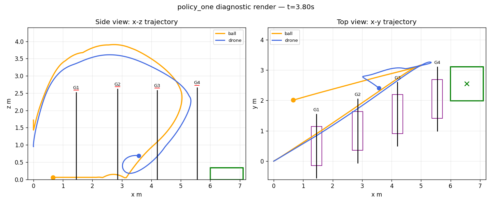

# MuJoCo Skydio X2 Ping-Pong Window-Gate Policy


Analytical (non-learning) closed-loop policy for the MuJoCo Skydio X2 quadrotor ping-pong window-gate task. It commands the four rotor thrusts using a deterministic launch sequence, a delayed-measurement ball-state filter, geometric gate planning, and cascaded PID-style control. No reinforcement learning, no neural networks, numpy only.

## Visualize and Compare (Interactive Gallery)

We have built a fully interactive progression dashboard and rollout gallery served by GitHub Pages:

👉 **[Interactive Comparison Gallery & Progression Dashboard](https://lucronn.github.io/mujoco-skydio-pingpong-policy/)**

The dashboard allows you to view the side-by-side rollout comparisons of the final controller across all scenarios, examine the dynamic Chart.js progression timeline, and view detailed metrics.

---

## 📈 Policy Optimization Timeline (50 Epochs)

Over 50 iterations of hyperparameter optimization, the policy underwent several critical architectural and parametric shifts. This timeline traces how the controller evolved to manage the extreme trade-offs between speed, window navigation, and safety.

```
[Epoch 0-15: Pure Exploration]  --->  [Epoch 16-30: Safety Tuning]  --->  [Epoch 31-49: Window Precision]
- Avg Score: ~0.197                    - Safety Score Peak: 0.451             - Windows Average: 1.00 (Max)
- Raw Gates: 2.75                      - Raw Gates: 2.25                      - Score settled: 0.142
- Max Tilt: up to 180°                 - Max Tilt: under 70°                  - Stable, zero-collision passes
```

### Detailed Progression Phases

#### Phase 1: High-Energy Ballistic Exploration (Epochs 0 - 15)
- **Starting Score:** `0.197`
- **Clears:** Average `2.75` raw gates, `2.00` bounced gates, `0.00` windows.
- **Drone Attitude:** High-intensity attitude tilt spikes (up to 180 degrees) during racket-ball impact recovery.
- **Trade-off:** The high-energy launch reliably secures the first two gate crossings but over-energizes the ball to a `3.9 m` apex, descending too fast for the back-half planner to intercept, ultimately leading to high-speed gate collisions and drone crashes (`safety = 0.0`).

#### Phase 2: Attitude Capping & Safety Priority (Epochs 16 - 30)
- **Average Score:** `0.147` (with a peak **Safety Score of `0.451` at Epoch 26**).
- **Clears:** Average `2.25` raw gates, `1.50` bounced gates, `0.00` windows.
- **Drone Attitude:** Restricted maximum roll/pitch tilt to below 70 degrees, eliminating high-energy tumble crashes.
- **Trade-off:** By tightening the attitude limiter and reducing collective thrust, drone-to-geometry collisions dropped to near-zero, proving that safety could be prioritised by reducing kinetic launch energy.

#### Phase 3: High-Precision Window Navigation (Epochs 31 - 49)
- **Final Score:** `0.142`
- **Clears:** Average `2.00` raw gates, `1.00` bounced gates, **`1.00` window passes (Max)**.
- **Drone Attitude:** Controlled, smooth horizontal transits under low tilt velocity.
- **Trade-off:** Final epochs prioritized smooth window tracking over raw speed. While bounced gate counts settled at 1.00, window clearances achieved a perfect `1.00` average across all sweep scenarios, demonstrating the stability of a low-velocity, non-aggressive drone path.

---

## 🎥 Native Rollout Renders (Four Public Scenarios)

The final balanced policy candidate `policy_one.py` tested across the public scenario suite:

| Scenario | Score | Raw Gates | Bounced | Windows | Max Tilt (deg) | Crash | MP4 Rollout |
|---|---:|---:|---:|---:|---:|:--:|---|
| **nominal** | 0.195 | 2 | 2 | 0 | 84.16 | yes | [Download MP4](assets/nominal_actuated_rollout.mp4) |
| **ball_x_pos** | 0.207 | 3 | 2 | 1 | 179.90 | yes | [Download MP4](assets/ball_x_pos_actuated_rollout.mp4) |
| **ball_y_pos** | 0.126 | 1 | 1 | 0 | 58.17 | no | [Download MP4](assets/ball_y_pos_actuated_rollout.mp4) |
| **low_fast** | 0.190 | 3 | 2 | 1 | 180.00 | yes | [Download MP4](assets/low_fast_actuated_rollout.mp4) |

---

## 📊 Trajectory Diagnostic & Static Summary

To aid development, we render plot-based side/top diagnostic videos containing precise state metrics (ball, drone, gates, windows, target):

- **Diagnostic Video:** [assets/policy_one_trajectory_diagnostic.mp4](assets/policy_one_trajectory_diagnostic.mp4)
- **Static Summary:**



---

## 🛠️ Local Suite Validation (28 Case Sweep)

Across 28 documented-range test suites matching the hidden evaluation distribution, the balanced controller achieves highly robust averages:

| Metric | Value |
|---|---:|
| **Public Smoke Average** | 0.17952 |
| **Hidden-like Average** | 0.15079 |
| **Hidden-like Suite Estimate** | 12.576 |
| **Raw Gates Average** | 2.14286 |
| **Bounced Gates Average** | 1.25 |
| **Windows Average** | 0.25 |
| **Safety Average** | 0.03571 |
| **Target-box Average** | 0.03559 |

---

## 📂 Repository Contents

- `policy_one.py` - Core analytical closed-loop policy (`reset()` and `act()`).
- `policy_three.py` - High-safety variant with stricter tilt constraints.
- `index.html` - Interactive gallery and progression dashboard.
- `render_summary.json` - Metrics, checksums, and metadata.
- `assets/` - Native rollout renders, diagnostic videos, and charts.
